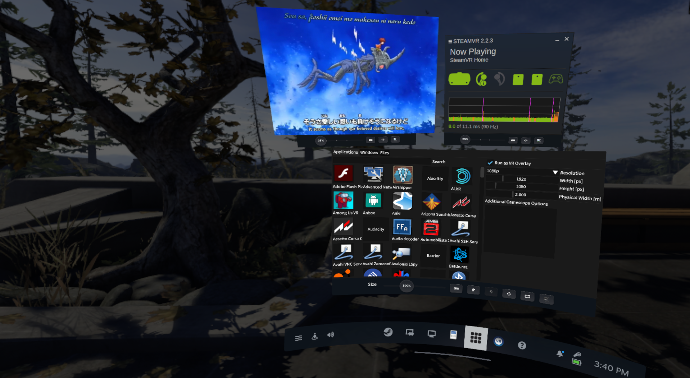

# launcher-openvr-overlay

Quick shortcuts to access desktop applications and play videos without taking
off your VR headset. 



## Features

- Start desktop applications wrapped in an OpenVR overlay using [`gamescope`](https://github.com/ValveSoftware/gamescope);
- Mirror applications running on your monitor to an overlay using [`vr-video-player`](https://git.dec05eba.com/vr-video-player/about/);
- Play video files directly using `vr-video-player`;
- Can start automatically with SteamVR (Settings → Startup / Shutdown → Choose
  Startup Overlay Apps). 

## Dependencies

- [Dear ImGui](https://github.com/ocornut/imgui) (included as a git submodule)
- [libnkutils](https://github.com/sardemff7/libnkutils) (included as a git submodule)
- [SDL2](https://www.libsdl.org/) (tested with version 2.28.5)
- [openvr](https://github.com/ValveSoftware/openvr) (tested with version 1.23.8)
- [glibmm-2.68](https://gitlab.gnome.org/GNOME/glibmm) (tested with version 2.78.0)
- [glew](https://github.com/nigels-com/glew) (tested with version 2.2.0)
- [Xlib](https://xorg.freedesktop.org/wiki/) (tested with version 1.8.7)
- [oneApi TBB](https://oneapi-src.github.io/oneTBB/) (tested with version 2021.11.0)
- [gamescope](https://github.com/ValveSoftware/gamescope) (optional)
- [vr-video-player](https://git.dec05eba.com/vr-video-player/about/) (optional)

Additional build dependencies:

- [CMake](https://www.cmake.org/)
- [pkgconf](https://gitea.treehouse.systems/ariadne/pkgconf)

## Install

Install the dependencies, for example on Arch Linux:

```sh
pacman -S sdl2 openvr glibmm-2.68 glew libx11 onetbb cmake pkgconf gamescope
```

`vr-video-player` can be installed from
[AUR](https://aur.archlinux.org/packages/vr-video-player-git). 

Clone and compile:
```sh
git clone --recurse-submodules https://github.com/Mon-Ouie/launcher-openvr-overlay
cd launcher-openvr-overlay
mkdir build
cd build
cmake .. && make
```

Install (by default, to `/usr/local`):
```sh
make install
```

After running the executable once (`launcher-openvr-overlay`), the option to
automatically start the overlay will show up in the SteamVR settings.

## License

`launcher-openvr-overlay` is released under the MIT license. Included files that
are part of other works, possibly released under other licenses, are listed
below.

| Files                   | Author(s)                                                                       | License   |
|-------------------------|---------------------------------------------------------------------------------|-----------|
| src/source\_sans\_pro.h | [Adobe](https://github.com/adobe-fonts/source-sans)                             | OFL-1.1   |
| src/color\_theme.h      | [@janekb04](https://github.com/ocornut/imgui/issues/707#issuecomment-917151020) | CC-BY-4.0 |
| src/stb\_image.h        | [Sean Barrett, stb contributors](https://github.com/nothings/stb)               | MIT       |
